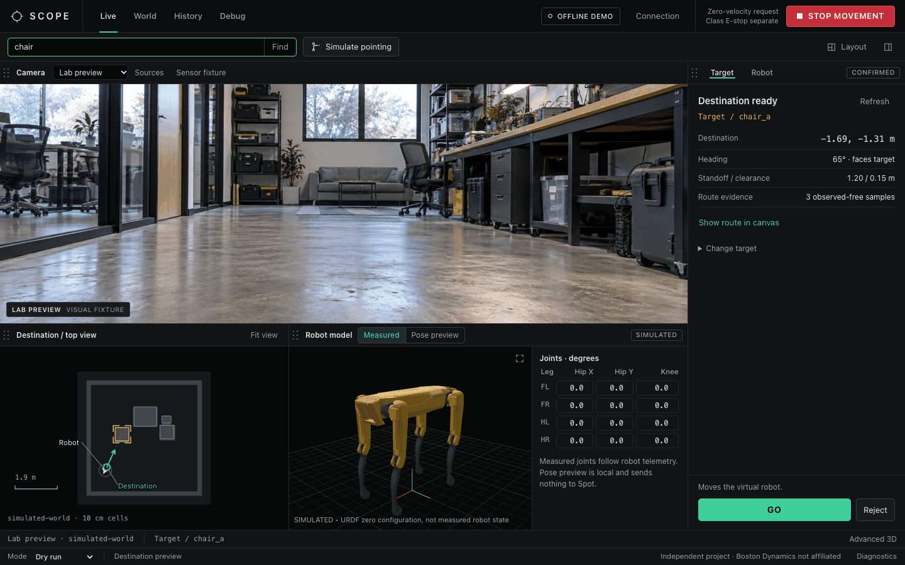
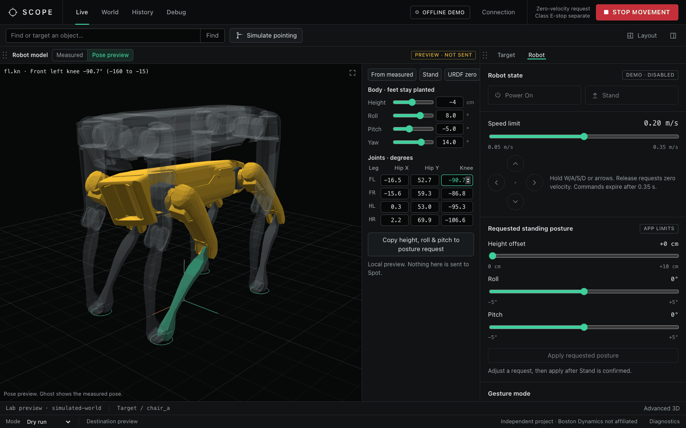

# Boston Dynamics Spot Control Console (SCOPE)

SCOPE (Spot Control, Observation, and Preview Environment) is a local browser console for a Spot robot. It shows the cameras, lets you drive manually, and lets you pick a target by text, pointing or a click on the map, with a destination preview before GO. An offline demo with a simulated room lets you try it without a robot.

This is an independent project, not a Boston Dynamics product, and nothing here is endorsed by them.



*Offline demo. The camera image is a generated fixture, not a Spot capture, and the robot model is the SDK model at its zero pose, not measured robot state.*

## What works, and what doesn't

The console has been run on macOS Apple Silicon with Python 3.14. Windows and Linux are untested. The browser console has not been validated on a physical robot, so treat every robot mode as untried until you have tested it yourself.

| Mode | Spot needed | What it does |
| --- | --- | --- |
| Offline demo | No | Simulated room and camera images with a virtual robot. GO moves only the virtual robot. Power, Stand, drive and posture are disabled. |
| Observe | Yes, read-only | Cameras and robot state. No command lease and no GO. This is the default for a live connection. |
| Dry run | Yes, read-only | The same target and destination pipeline. GO records the destination (`WOULD_EXECUTE_NO_MOTION`) and sends nothing. |
| Robot control | Yes, with a lease | Adds manual drive and standing posture. Needs explicit command authority and the separate class E-stop. GO is disabled. |

GO that moves the real robot is not in this branch. A supervised version exists on `codex/m5-live-spot-interaction`; it has only been exercised with a fake command client.

## Quick start

Python 3.11 to 3.14 is required.

```sh
python3 -m venv .venv
.venv/bin/python -m pip install -r requirements-console.txt
.venv/bin/python scope_web.py --demo
```

This opens a page on `http://127.0.0.1`. Useful options: `--port 8766`, `--no-browser`, and `--runs-dir PATH` (repeatable, default `./runs`) for the History page.

To connect to a robot, start without `--demo`, then use **Connection**:

```sh
.venv/bin/python scope_web.py
```

Credentials are used for that connection and are not saved. The server listens on the loopback address only.

**macOS launcher.** Download the ZIP from GitHub, extract it, and run `zsh "Open SCOPE.command"`. It needs Git, Python 3.11 to 3.14 and an internet connection. It clones the repository to `~/Library/Application Support/SCOPE`, builds its own environment, and updates from `main` on each launch. The update logic was checked against a temporary Git repository; a fresh install from GitHub has not been run.

The Spot SDK, model bundles, credentials and camera captures are not in this repository. The robot model panel reads `spot-sdk/files/spot_base_urdf.zip` from a local SDK checkout and says so when it is missing.

## Using the console

| Page | What it is for |
| --- | --- |
| Live | Camera, world map, robot model and an inspector with **Target** and **Robot** tabs. |
| World | Occupancy map, entities and robot pose. **3D in Rerun** opens the advanced viewer. |
| History | The latest 500 maps, memory files, results and recordings under the `--runs-dir` folders. Read-only. `.rrd` files open in Rerun. |
| Debug | Copyable benchmark commands and module health. |

### Pick a target and preview a destination

1. Type `chair` in the search box. Other ways in: **Simulate pointing**, or **World**, select an entity, **Use as target**.
2. Pick a candidate and press **Confirm target**.
3. Check the destination, heading, standoff and route evidence in the inspector.
4. Press **GO**. Each preview works once and expires after 10 s, and evidence older than 1.5 s cannot be confirmed.

### Drive and posture (Robot control only)

| Control | Value |
| --- | --- |
| Speed limit | 0.05 to 0.35 m/s, starts at 0.20 m/s |
| Drive | Hold W/A/S/D, the arrow keys, or an on-screen direction button |
| Command expiry | 0.35 s without an update. The browser presence timeout is 0.30 s. |
| Height offset | 0 to +10 cm |
| Roll and pitch | ±5° each |

Driving unlocks only after fresh robot state confirms Spot is standing. Releasing a key requests zero velocity. Stop, focus loss, a hidden tab, a connection failure and shutdown all clear movement. The posture sliders set a request for **Apply**; they are not measured state, and Spot may not move by exactly the amount asked. The 0 to 10 cm and ±5° limits are conservative app limits, not verified safe ranges for this robot.

**STOP MOVEMENT** requests zero velocity and clears any approval. It is not the class E-stop.

### Robot model and layout

The **Robot model** panel draws the SDK model. In **Measured** mode it follows the 12 leg joint angles from fresh robot telemetry, but only when the robot's skeleton matches the SDK model. Body tilt is not measured, so the model is always drawn level. In the demo it shows the zero pose, labeled simulated.

**Pose preview** is local and sends nothing to Spot. Drag a leg or the body (Alt-drag for roll), or type joint angles and body height, roll, pitch and yaw. The feet stay planted with an approximate solver, and the Stand pose assumes a 0.52 m body height that was never measured. **Copy height, roll & pitch to posture request** fills the posture sliders, clamped to the limits above. Yaw stays in the preview.



Panels on Live and World can be rearranged: drag a panel bar onto another panel's edge to split it, onto its center to swap, or onto the workspace edge to dock. Drag the dividers to resize. **Layout** shows, hides and resets panels, and the arrangement is saved in the browser. Below 650 px wide the panels stack and cannot be dragged.

## Connecting to a real robot

1. Connect to Spot's network and confirm the robot address with your instructor. The class handout uses `192.168.80.3`.
2. Start the SDK's class E-stop in its own Terminal and leave it open. Space triggers it, `r` releases it, and `q` quits:

   ```sh
   source .venv/bin/activate
   python spot-sdk/python/examples/estop/estop_nogui.py 192.168.80.3
   ```

3. Start the console in a second Terminal, open **Connection**, and enter the address, username and password. Choose Robot control only if you need to drive, and tick the command authority box once the E-stop is running.

Camera settings (**Sources** on the Live camera panel) control acquisition, display and rate for each source, from above 0 up to 30 Hz. One visual and depth pair feeds perception. Mapping and destination preview need physically verified alignment, calibration, timestamps and odom transforms. The alignment checkbox records that you checked it; it does not calibrate anything. The front panorama is an approximate stitch.

Returning to Observe or Dry run stops movement but keeps an existing command lease until you press **Disconnect**.

## More tools

- [Desktop (Qt) console](docs/qt-console.md): the original manual console, with supervised gesture mode and the front panorama.
- [Offline mapping and perception](docs/offline-tools.md): RGB-D mapping, semantic objects, persistent memory, human pointing and text object queries, all runnable without a robot.
- [Unified console guide](docs/unified-console.md), the [M5 checklist](docs/milestone-5.md) and the [development history](docs/development-history.md).

To run the tests:

```sh
.venv/bin/python -m unittest discover
```

The suite has 118 tests, and 3 of them skip unless optional datasets are present.

## Future plans

Ideas only, none of this is in the app.

| Area | Direction |
| --- | --- |
| Voice input | Connect a microphone for spoken commands. |
| Wearable interfaces | Explore control or viewing through VR headsets or Meta Ray-Ban smart glasses. |
| Emotion-aware interaction | Investigate visual cues for human emotion recognition. |
| Recognition and personalities | Explore opt-in facial recognition and distinct interaction personalities for known people. |

## Contact

Ideas or questions: [monishsaravana@college.harvard.edu](mailto:monishsaravana@college.harvard.edu).

## Licensing

- SCOPE's own files use the [MIT License](LICENSE). It does not cover the SDK or third-party models.
- The Spot SDK is excluded. If you redistribute SDK files, Boston Dynamics' [SDK license](https://github.com/boston-dynamics/spot-sdk/blob/master/LICENSE) requires its full text and notices, and it restricts trademark use that implies endorsement.
- The MediaPipe gesture bundles are excluded until their redistribution terms are confirmed.
- The Grounding DINO Tiny, OWLv2 Base and SAM 2.1 Tiny model cards list Apache-2.0, and the bundles are still excluded. Revisions and links are in the [M4.5 report](docs/milestone-4.5.md).
