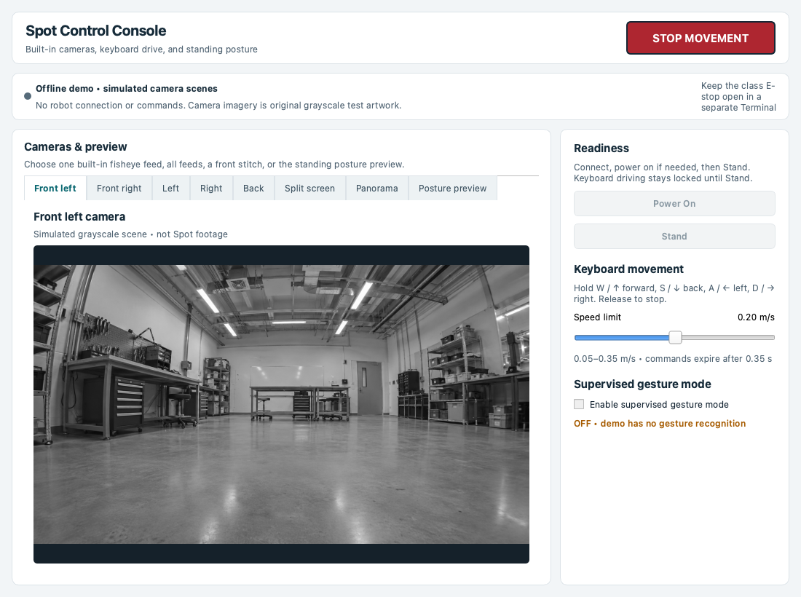
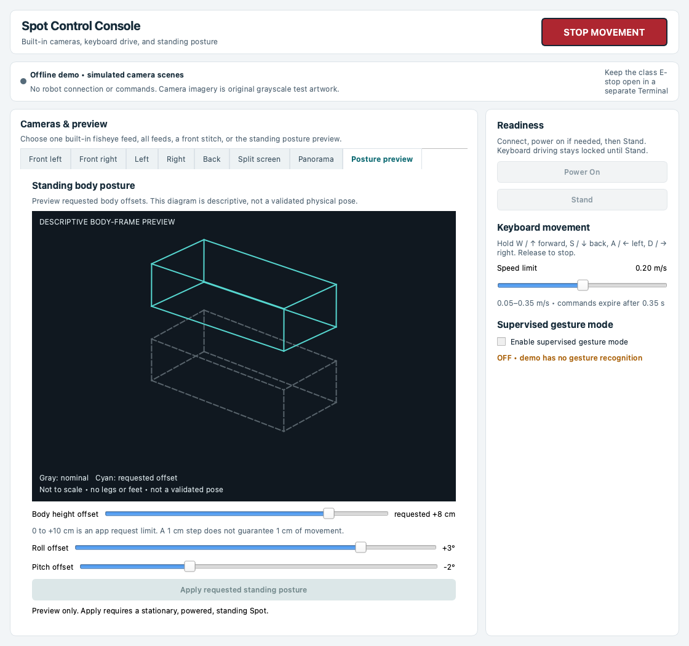

# Boston Dynamics Spot Control Console (SCOPE)

**SCOPE** stands for **Spot Control, Observation, and Preview Environment**. This Python desktop app displays Spot's built-in fisheye cameras and requests power, stand, movement, and standing-posture commands through the Spot SDK. It also has an optional depth-assisted gesture mode.

The front panorama is an approximate stitch of two cameras. The posture diagram shows requested offsets, not Spot's measured pose. SCOPE is an independent project, not an official or endorsed Boston Dynamics product.

## Contents

- [Install](#install)
- [Run with the class E-stop](#run-with-the-class-e-stop)
- [Controls and views](#controls-and-views)
- [Offline demo and screenshots](#offline-demo-and-screenshots)
- [Future plans](#future-plans)
- [Contact](#contact)
- [Licensing and compatibility](#licensing-and-compatibility)
- [Development history](docs/development-history.md)

## Install

Install **Python 3.14** and **Git** first. The commands below keep the project, its virtual environment, and the Spot SDK examples in separate locations. Clone the project once you have access to the repository.

### macOS Apple Silicon

Install [Homebrew](https://brew.sh/) if needed. In Terminal:

```sh
brew install git python@3.14
cd "$HOME"
git clone https://github.com/monishsaravana/boston-dynamics-spot-control-console.git
cd boston-dynamics-spot-control-console
python3.14 -m venv .venv
source .venv/bin/activate
python -m pip install --upgrade pip
python -m pip install 'bosdyn-client==5.2.0' 'PySide6==6.11.2' Pillow 'opencv-contrib-python==5.0.0.93' 'mediapipe==0.10.35'
git clone --branch v5.2.0 --depth 1 https://github.com/boston-dynamics/spot-sdk.git "$HOME/spot-sdk"
```

### Windows 64-bit (PowerShell)

Install [Python 3.14 for Windows](https://www.python.org/downloads/windows/) with the Python launcher, and [Git for Windows](https://git-scm.com/download/win). In PowerShell:

```powershell
Set-Location $HOME
git clone https://github.com/monishsaravana/boston-dynamics-spot-control-console.git
Set-Location .\boston-dynamics-spot-control-console
py -3.14 -m venv .venv
.\.venv\Scripts\Activate.ps1
python -m pip install --upgrade pip
python -m pip install bosdyn-client==5.2.0 PySide6==6.11.2 Pillow opencv-contrib-python==5.0.0.93 mediapipe==0.10.35 windows-curses
git clone --branch v5.2.0 --depth 1 https://github.com/boston-dynamics/spot-sdk.git "$HOME\spot-sdk"
```

`windows-curses` supports the terminal interface in `estop_nogui.py`. If PowerShell blocks activation, run `Set-ExecutionPolicy -Scope Process Bypass` in that window, then activate the environment again.

### Optional gesture models

Gesture mode needs two local MediaPipe bundles. Download them from Google's model pages and save them with these names under `models/`:

| Download | Local filename |
| --- | --- |
| [Gesture Recognizer](https://developers.google.com/edge/mediapipe/solutions/vision/gesture_recognizer#models) | `gesture_recognizer.task` |
| [Pose Landmarker Lite](https://developers.google.com/edge/mediapipe/solutions/vision/pose_landmarker#models) | `pose_landmarker_lite.task` |

The rest of the GUI runs without them; gesture mode cannot start if they are missing. The bundles are excluded from this repository while their redistribution terms are reviewed.

## Run with the class E-stop

1. Connect the computer to Spot's network and **confirm the robot IP with your instructor**. The commands use the class handout example `192.168.80.3`; replace it in both commands if needed.
2. Start the SDK's class E-stop in one Terminal and keep it open.
3. Start the GUI in a second Terminal. Enter credentials only when the SDK prompts in Terminal.

### macOS

**Terminal 1 — class E-stop**

```sh
cd "$HOME/boston-dynamics-spot-control-console"
source .venv/bin/activate
python "$HOME/spot-sdk/python/examples/estop/estop_nogui.py" 192.168.80.3
```

**Terminal 2 — GUI**

```sh
cd "$HOME/boston-dynamics-spot-control-console"
source .venv/bin/activate
python spot_control_gui.py --hostname 192.168.80.3
```

### Windows

**PowerShell 1 — class E-stop**

```powershell
Set-Location "$HOME\boston-dynamics-spot-control-console"
.\.venv\Scripts\Activate.ps1
python "$HOME\spot-sdk\python\examples\estop\estop_nogui.py" 192.168.80.3
```

**PowerShell 2 — GUI**

```powershell
Set-Location "$HOME\boston-dynamics-spot-control-console"
.\.venv\Scripts\Activate.ps1
python spot_control_gui.py --hostname 192.168.80.3
```

In the E-stop Terminal, **Space** triggers the E-stop, **r** releases it, and **q** quits. Follow your instructor's operating procedure. The GUI's **STOP MOVEMENT** button requests zero velocity; it does not operate the class E-stop.

## Controls and views

### Cameras and panorama

| View | What it shows |
| --- | --- |
| Camera tabs | One tab per available built-in fisheye feed. |
| Split screen | The available built-in feeds together. |
| Front panorama | An approximate stitch of the front-left and front-right feeds. Drag to pan and use the wheel to zoom. |

Camera tabs report when they are loading, receiving images, or stopped after a connection error. They do not require Spot CAM or another payload camera.

**Continuously update** requests a new stitch about every two seconds and is on by default. Turn it off to pause, or select **Stitch current front frames once**. Stitching runs off the UI thread and pauses during gesture mode.

OpenCV may fail to align the frames or distort the scene. The result is neither calibrated nor a 360° view; individual feeds continue after a stitch failure. See Boston Dynamics' [calibrated front-stitching example](https://dev.bostondynamics.com/python/examples/stitch_front_images/readme) for comparison.

### Drive and stop

| Control | Action |
| --- | --- |
| **Power On**, then **Stand** | Prepare Spot for movement if it is not already powered and standing. |
| Hold **W/A/S/D** or arrow keys | Move forward, left, backward, or right. Diagonal input stays within the same speed cap. |
| **Speed limit** | Requests 0.05–0.35 m/s; starts at 0.20 m/s. |
| **STOP MOVEMENT** | Clears held keys, disables gesture mode, and requests zero velocity when powered. It does not power Spot off. |

Releasing a movement key requests zero velocity. Motion commands expire after **0.35 seconds** without updates. The app also requests zero velocity on focus loss, connection failure, and exit.

### Standing-posture preview

The diagram shows requested body offsets from nominal stand. It has no leg or foot model and is not to scale. Moving a slider changes only the preview.

| Request | App range | Step |
| --- | --- | --- |
| Height offset | 0 to +10 cm | 1 cm |
| Roll | −5° to +5° | 1° |
| Pitch | −5° to +5° | 1° |

**Apply requested standing posture** sends a stand request only when fresh robot state reports standing and near-zero body velocity, with no movement or gesture input active. These are app request limits, not physical guarantees: a 1 cm request may not move Spot by 1 cm. Driving or Stop can return roll and pitch to nominal.

The SDK defines [body height relative to nominal stand height](https://dev.bostondynamics.com/python/bosdyn-client/src/bosdyn/client/robot_command.html), and its [programming tutorial](https://dev.bostondynamics.com/docs/python/understanding_spot_programming.html) shows a +0.1 m request. The SDK Xbox example's ±0.30 m clamp is an example constant, not a verified safe range. No safe lowering bound was verified for this robot.

### Supervised gesture mode

Enable this mode after **Stand**. It uses the front-left visual feed and aligned depth source, and disables keyboard driving.

| Signal | Hold for | Request |
| --- | --- | --- |
| Open palm | At least 0.5 s | Arm or rearm gesture mode. |
| One raised index finger | At least 0.6 s | Approach at up to 0.10 m/s while valid person and depth readings remain farther than 2.5 m. |
| Two raised fingers | At least 0.6 s | Back up at up to 0.10 m/s for at most 0.5 s. |

Show an open palm again before another command. Missing or stale observations, unclear signals, focus loss, or Stop cancel motion. Recognition and depth measurement can be wrong; keep the class E-stop available.

## Offline demo and screenshots

Run the full console without a robot:

```sh
python spot_control_gui.py --demo
```

Demo mode creates no robot client, authentication, lease, network request, or robot command.

- Five static grayscale scenes have **SIMULATED** labels. The demo panorama has known overlap for UI review; it does not validate live stitching.
- **Power On**, **Stand**, **Apply**, and gesture control stay disabled.
- Use `--offline-preview` for the older posture-only view.

These screenshots show the actual app window in offline demo mode. The original grayscale camera imagery was generated for this documentation and was **not captured from Spot**.






## Future plans

These are ideas for future work, not features in the current app.

| Area | Direction |
| --- | --- |
| Voice input | Connect a microphone for spoken commands. |
| Wearable interfaces | Explore control or viewing through VR headsets or Meta Ray-Ban smart glasses. |
| Emotion-aware interaction | Investigate visual cues for human emotion recognition. |
| Recognition and personalities | Explore opt-in facial recognition and distinct interaction personalities for known people. |

## Contact

For ideas or questions, email [monishsaravana@college.harvard.edu](mailto:monishsaravana@college.harvard.edu).

## Licensing and compatibility

- The Spot SDK checkout and virtual environment are excluded. Boston Dynamics' [SDK license](https://github.com/boston-dynamics/spot-sdk/blob/master/LICENSE) requires its full license and retained notices if SDK files are redistributed, and restricts trademark use that implies endorsement.
- The local MediaPipe model bundles are excluded until their redistribution terms are confirmed.
- SCOPE's original files use the [MIT License](LICENSE); it does not cover the SDK or third-party model bundles.

**Compatibility:** macOS Apple Silicon offline UI checked with Python 3.14.2; Windows and Linux not tested. Live robot operation has not been validated for this publication.
