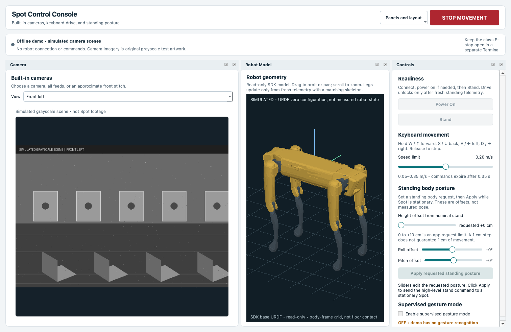
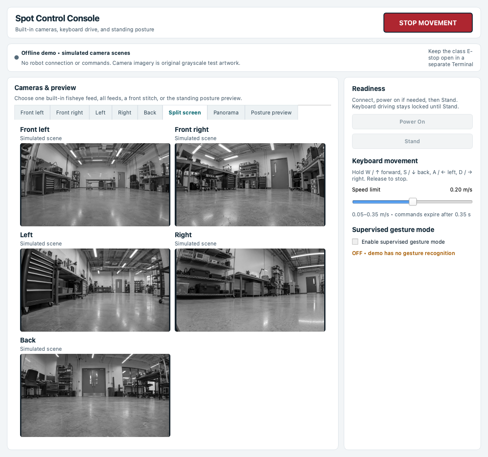

# Boston Dynamics Spot Control Console (SCOPE)

**SCOPE** (Spot Control, Observation, and Preview Environment) is an independent local Spot console. The primary browser app brings cameras, manual controls, target selection, destination preview and explicit GO into **Operate**, with **Maps**, **Runs** and **Evaluate** for inspection and existing offline tools. It shares the existing Qt console's perception and target adapters. Advanced point clouds, human skeletons, pointing rays, memory and timelines remain in Rerun.

The offline demo runs a synthetic room and virtual robot without connecting to Spot. Observe uses read-only Spot sensors; Dry run records the proposed destination without sending a movement command. Robot control requires an explicitly authorized connection and the separate class E-stop. The browser command path and M5 target-to-GO workflow have not been validated on a physical robot. **M5 remains READY FOR PHYSICAL VALIDATION** on `codex/m5-live-spot-interaction`.

The front panorama is an approximate stitch. Model geometry uses measured joints when fresh telemetry is available; posture sliders specify requested offsets. Synthetic images are fixtures, not Spot captures. SCOPE is not an official or endorsed Boston Dynamics product. See [the unified console guide](docs/unified-console.md) for workflows, preserved tools and verification limits.

## Contents

- [Install](#install)
- [Target interaction preview](#target-interaction-preview)
- [Local browser console](#local-browser-console)
- [Run with the class E-stop](#run-with-the-class-e-stop)
- [Controls and views](#controls-and-views)
- [Offline demo and screenshots](#offline-demo-and-screenshots)
- [Offline 3D mapping](#offline-3d-mapping)
- [Semantic objects in the map](#semantic-objects-in-the-map)
- [Persistent memory across visits](#persistent-memory-across-visits)
- [Human geometry, pointing, and module health](#human-geometry-pointing-and-module-health)
- [Local object queries and reality benchmarks](#local-object-queries-and-reality-benchmarks)
- [Future plans](#future-plans)
- [Contact](#contact)
- [Licensing and compatibility](#licensing-and-compatibility)
- [Development history](docs/development-history.md)

## Install

### Primary app from this checkout

Use Python 3.11–3.14. In this workspace, `.venv` already contains the required dependencies. For a fresh checkout:

```sh
python3 -m venv .venv
.venv/bin/python -m pip install -r requirements-console.txt
.venv/bin/python scope_web.py --demo
```

The unified browser now uses the existing mapping dependencies listed in `requirements-console.txt`. Optional query, human-pose and gesture model bundles remain separate; see their sections below. This setup guidance has not been checked as a fresh installation on other platforms.

### Managed browser launcher on macOS

From [GitHub](https://github.com/MonishSaravana/boston-dynamics-spot-control-console), choose **Code → Download ZIP**, extract it, and run `Open SCOPE.command` from the extracted folder. For a first run from Terminal, use:

```sh
cd /path/to/extracted/boston-dynamics-spot-control-console
zsh "Open SCOPE.command"
```

The first run needs Git, Python 3.11–3.14, and an Internet connection. The launcher clones this repository to `~/Library/Application Support/SCOPE/source`, creates a separate console environment at `~/Library/Application Support/SCOPE/venv`, and opens the local browser page. It also creates `~/Applications/Open SCOPE.command` for later launches. Re-running setup from another downloaded ZIP uses the same installation. On each launch it checks GitHub's `main` branch, fast-forwards the one checkout when possible, and reinstalls console dependencies only when the requirements or Python version changed. An update failure leaves the installed source in place and reports the problem before a live connection starts; if dependency installation fails, the console does not start. The repository excludes the SDK checkout, model bundles, credentials, and camera captures.

The update logic was checked against a temporary Git repository on macOS Apple Silicon; a fresh GitHub installation has not been run in this workspace. The official class E-stop remains a separate process and setup. The SDK base URDF is also separate; the browser's model panel reports when that mesh is unavailable. Gesture mode needs MediaPipe and the local model bundles described below.

### Existing desktop console

Use the existing `.venv` and `spot-sdk` checkout in this workspace. The installed environment was checked with Python 3.14.2, Spot SDK 5.2.0, PySide6 6.11.2, Pillow 12.3.0, OpenCV 5.0.0.93, and MediaPipe 0.10.35. The app does not import SciPy from the SDK image-viewer example.

#### macOS Apple Silicon

In Terminal, from this workspace:

```sh
cd /Users/monishsaravana/work/boston-dynamics-spot
source .venv/bin/activate
python -c 'import bosdyn.client, PySide6, PIL, cv2, mediapipe; print("Dependencies ready")'
```

If that import fails in a fresh environment, install only the missing package into `.venv`. The app uses `bosdyn-client==5.2.0`, `PySide6==6.11.2`, Pillow, `opencv-contrib-python==5.0.0.93`, NumPy, and optional `mediapipe==0.10.35` for gesture mode. The local SDK's `python/examples/wasd/requirements.txt` and `python/examples/get_image/requirements.txt` were inspected; SciPy is only needed by the latter example, not this app.

#### Optional gesture models

Gesture mode needs two local MediaPipe bundles. Download them from Google's model pages and save them with these names under `models/`:

| Download | Local filename |
| --- | --- |
| [Gesture Recognizer](https://developers.google.com/edge/mediapipe/solutions/vision/gesture_recognizer#models) | `gesture_recognizer.task` |
| [Pose Landmarker Lite](https://developers.google.com/edge/mediapipe/solutions/vision/pose_landmarker#models) | `pose_landmarker_lite.task` |

The rest of the GUI runs without them; gesture mode cannot start if they are missing. The bundles are excluded from this repository while their redistribution terms are reviewed.

## Target interaction preview

The primary browser exposes this same workflow; start it with `.venv/bin/python scope_web.py --demo`. The original Qt M5 console remains available on `codex/m5-live-spot-interaction` while physical validation is pending:

```sh
.venv/bin/python -m scope.m5_console --demo
```

Type `chair`, select one of the two candidates, press **CONFIRM TARGET**, inspect the highlighted object and proposed route, then press **GO · virtual**. **Simulate pointing** and direct entity selection use the same confirmation path. Synthetic images and map geometry are test fixtures, not Spot captures.

To inspect physical image sources without a lease or movement, run:

```sh
.venv/bin/python -m scope spot-sensors --hostname ROBOT_IP --samples 10
```

Then start the default dry-run console using a source name from that report:

```sh
.venv/bin/python -m scope.m5_console --spot ROBOT_IP --visual-source VISUAL_SOURCE
```

Camera acquisition and query overlays can run without depth. Mapping and destination generation require a measured aligned depth pair, calibration, source timestamps, and odom transforms. The console refuses RGB-D geometry until the operator has checked alignment on the robot and explicitly passes `--depth-source DEPTH_SOURCE --alignment-verified`. Default Spot GO records `WOULD_EXECUTE_NO_MOTION` and sends no command. A separate `--supervised-go` option is reserved for the final physical gate after the class E-stop, geometry, target, route, and dry-run checks. See [the M5 checklist](docs/milestone-5.md) for the ordered validation procedure and remaining limits.

## Local browser console

From this checkout, launch the primary app without a robot:

```sh
.venv/bin/python scope_web.py --demo
```

The server opens a local `http://127.0.0.1` address. For a fixed port or an additional artifact directory:

```sh
.venv/bin/python scope_web.py --demo --port 8766 --runs-dir runs --runs-dir /path/to/other/runs
```

In **Operate**, type `chair`, select a candidate, confirm it, inspect destination coordinates, heading, standoff and route, then press **GO · virtual**. Simulate pointing and **Maps → select entity → Use as target** enter the same workflow. GO consumes its preview; another GO requires a fresh preview. Camera evidence and map geometry in demo mode are synthetic fixtures. Power, Stand, manual drive, posture Apply and physical gestures stay disabled. The optional SDK mesh is labeled simulated.

The **Robot model** panel draws the SDK base URDF from the local `spot-sdk/files/spot_base_urdf.zip`; the server reads it at runtime and the repository does not contain the meshes. **Measured** follows the 12 leg joint angles that the command session reports from fresh robot telemetry, after the robot's skeleton matches the SDK base model. Body attitude is not measured here, so the model is drawn level with its lowest foot on the grid. In demo mode it shows the URDF zero configuration, labeled simulated. **Pose preview** is local: drag a leg to rotate the joint that drives it, drag the body to change yaw and pitch (Alt-drag for roll), or type values. Body height, roll, pitch and yaw keep the feet planted with an approximate inverse-kinematics solve; the Stand pose uses an assumed 0.52 m body height, not a measured one. Joint inputs are limited to the URDF ranges. Nothing in the preview is sent to Spot. **Copy height, roll & pitch to posture request** fills the existing posture sliders, clamped to the app limits (0–10 cm, ±5°); yaw stays preview-only, and Apply keeps its Stand and stationary checks.

Panels in Live and World can be rearranged: drag a panel bar onto another panel's edge to split it, onto its centre to swap, or onto the workspace edge to dock along it. Drag the dividers to resize. **Layout** shows or hides panels and resets the arrangement, which is saved per browser. Dragging or resizing clears any held movement. Below 650 px wide, panels stack in a fixed order.

**Maps** shows current occupancy, entities, robot pose and destination. **Advanced 3D / Rerun** gives the existing viewer workflow. **Runs** indexes the latest 500 local map, memory, result and recording artifacts in configured directories, supports read-only inspection, and opens `.rrd` recordings in Rerun. **Evaluate** provides copyable existing benchmark commands, current module health and the original consoles/CLIs.

For the live connection form:

```sh
.venv/bin/python scope_web.py
```

Observe is the default: authenticate read-only sensors without taking a command lease. Dry run uses the same target/destination pipeline and records the exact SE2 destination, with no movement command. Robot control requires selecting that mode in the connection form and explicitly granting command authority after starting the class E-stop. Manual controls and supervised GO share the existing command session and lease. Returning to Observe or Dry run stops movement but retains an existing command connection until **Disconnect** returns its lease; reconnect in Observe for a sensor-only session.

Camera settings independently control acquisition, display and rate (above 0 through 30 Hz) for each source. One selected visual/depth pair feeds perception. Mapping and destination preview require physically verified alignment, calibration, timestamps and odom transforms. The alignment checkbox records the operator's verification; it does not establish calibration. Optional human pose must be enabled when connecting. No speculative multi-camera Spot fusion is added.

After fresh standing readiness, hold W/A/S/D, arrows or a direction button to drive at the requested 0.05–0.35 m/s limit. Release requests zero velocity. Manual commands expire after 0.35 s; the browser presence timeout is 0.30 s. Existing supervised trajectory commands expire after 0.75 s and recheck robot/route state while executing. Stop, focus loss, a hidden tab, connection failure and shutdown clear movement authority. Manual motion, posture and gestures cannot run alongside active GO.

Credentials are used for that connection and not saved. The server listens only on the laptop's loopback address. **STOP MOVEMENT** requests zero velocity and clears approval; it does not operate the separate class E-stop. Keep the class E-stop available. See [the physical M5 checklist](docs/milestone-5.md) before any supervised test. No live robot was used for this interface pass.

## Run with the class E-stop

1. Connect the computer to Spot's network and **confirm the robot IP with your instructor**. The commands use the class handout example `192.168.80.3`; replace it in both commands if needed.
2. Start the SDK's class E-stop in one Terminal and keep it open.
3. Start the GUI in a second Terminal. Enter credentials only when the SDK prompts in Terminal.

### macOS

**Terminal 1 — class E-stop**

```sh
cd /Users/monishsaravana/work/boston-dynamics-spot
source .venv/bin/activate
python spot-sdk/python/examples/estop/estop_nogui.py 192.168.80.3
```

**Terminal 2 — GUI**

```sh
cd /Users/monishsaravana/work/boston-dynamics-spot
source .venv/bin/activate
python spot_control_gui.py --hostname 192.168.80.3
```

In the E-stop Terminal, **Space** triggers the E-stop, **r** releases it, and **q** quits. Follow your instructor's operating procedure. The GUI's **STOP MOVEMENT** button requests zero velocity; it does not operate the class E-stop.

## Controls and views

The following dock/layout instructions describe the retained Qt manual console. The browser provides the same manual requests beneath Operate and uses its four-page shell.

### Cameras and panorama

The default dashboard shows Camera, Robot Model, and Controls together. Drag a panel title to move it, drag the divider to resize it, or use its title-bar buttons to float or hide it. The **Panels and layout** menu in the header restores hidden panels and offers **Balanced**, **Camera Focus**, **Model Focus**, and **Restore Default Layout**. Your arrangement is saved when the window closes. Stop and connection status stay visible above the panels. The Camera panel's **View** selector changes feeds, split screen, and panorama without replacing the robot model.

| View | What it shows |
| --- | --- |
| Camera View selector | One choice per available built-in fisheye feed. |
| Split screen | The available built-in feeds together. |
| Front panorama | An approximate stitch of the front-left and front-right feeds. Drag to pan and use the wheel to zoom. |

Camera views report when they are loading, receiving images, or stopped after a connection error. They do not require Spot CAM or another payload camera.

**Continuously update** requests a new stitch about every two seconds and is on by default. Turn it off to pause, or select **Stitch current front frames once**. Stitching runs off the UI thread and pauses during gesture mode.

OpenCV may fail to align the frames or distort the scene. The result is neither calibrated nor a 360° view; individual feeds continue after a stitch failure. See Boston Dynamics' [front-stitching example](https://dev.bostondynamics.com/python/examples/stitch_front_images/readme) for comparison.

### Drive and stop

| Control | Action |
| --- | --- |
| **Power On**, then **Stand** | Prepare Spot for movement if it is not already powered and standing. |
| Hold **W/A/S/D** or arrow keys | Move forward, left, backward, or right. Diagonal input stays within the same speed cap. |
| **Speed limit** | Requests 0.05–0.35 m/s; starts at 0.20 m/s. |
| **STOP MOVEMENT** | Clears held keys, disables gesture mode, and requests zero velocity when powered. It does not power Spot off. |

Releasing any movement key requests zero velocity before the remaining held direction resumes. Motion commands expire after **0.35 seconds** without updates. The app also requests zero velocity on Stop, focus loss, connection failure, and exit. Keyboard control unlocks only after fresh robot state confirms standing and near-zero odometry velocity.

### Read-only robot geometry and standing posture

The resizable dashboard keeps the selected camera view and robot mesh visible together. The mesh is loaded from the local SDK's `spot-sdk/files/spot_base_urdf.zip`; the [RobotStateService joint positions](https://dev.bostondynamics.com/docs/concepts/robot_services) update its leg geometry when fresh telemetry is available **and** the robot reports a matching base skeleton. If its skeleton differs or cannot be verified, geometry is hidden rather than shown as the wrong robot. Mouse orbit, pan, and zoom only change the view. The mesh has a body-frame reference grid; it does not represent measured floor contact, collision clearance, balance, or the robot's actual body orientation. If the SDK ZIP is missing, the model reports that in the UI while the other controls remain available. Demo mode shows the URDF zero configuration and labels it as simulated.

The standing posture sliders edit a request; they do not move the on-screen mesh or Spot until **Apply requested standing posture** sends the SDK's high-level stand command after a fresh stationary check. No individual joint control is exposed. Boston Dynamics describes [joint control](https://dev.bostondynamics.com/docs/concepts/joint_control/readme) as a controlled-access beta requiring a special-permissions license and high-rate streaming; that access cannot be verified offline.

| Request | App range | Step |
| --- | --- | --- |
| Height offset | 0 to +10 cm | 1 cm |
| Roll | −5° to +5° | 1° |
| Pitch | −5° to +5° | 1° |

**Apply requested standing posture** sends a stand request only when fresh robot state reports standing and near-zero body velocity, with no movement or gesture input active. The roll and pitch ±5° values are conservative **app request limits**, below the SDK Xbox example's example clamps; no robot-specific safe range has been verified. Height 0 to +10 cm is likewise an app limit based on the SDK tutorial's +0.1 m request. These are not physical guarantees: a 1 cm request may not move Spot by 1 cm. Driving or Stop can return roll and pitch to nominal.

The SDK defines [body height relative to nominal stand height](https://dev.bostondynamics.com/python/bosdyn-client/src/bosdyn/client/robot_command.html), and its [programming tutorial](https://dev.bostondynamics.com/docs/python/understanding_spot_programming.html) shows a +0.1 m request. The SDK Xbox example's ±0.30 m clamp is an example constant, not a verified safe range. No safe lowering bound was verified for this robot.

### Supervised gesture mode

Enable this mode after **Stand** is confirmed. It uses the front-left visual feed and aligned depth source, and disables keyboard driving. The other camera feeds keep updating; panorama stitching pauses while gesture recognition is active.

| Signal | Hold for | Request |
| --- | --- | --- |
| Open palm | At least 0.5 s | Arm or rearm gesture mode. |
| One raised index finger | At least 0.6 s | Approach at up to 0.10 m/s while valid person and depth readings remain farther than 2.5 m. |
| Two raised fingers | At least 0.6 s | Back up at up to 0.10 m/s for at most 0.5 s. |

Show an open palm again before another command. The detector requires one associated visible hand and person, a high-confidence gesture, fresh synchronized visual/depth frames, and a reliable segmented torso depth for approach. Missing or stale observations, unclear signals, focus loss, or Stop cancel motion. The 2.5 m software cutoff provides margin above 2 m, but camera depth, segmentation, latency, and unseen obstacles have **not** been validated on this robot; it is not a certified person-distance safeguard. Keep the class E-stop available and supervise closely.

## Offline demo and screenshots

Run the full console without a robot:

```sh
python spot_control_gui.py --demo
```

Demo mode creates no robot client, authentication, lease, network request, or robot command.

- Five static grayscale scenes have **SIMULATED** labels. The demo panorama has known overlap for UI review; it does not validate live stitching.
- **Power On**, **Stand**, high-level **Apply**, and gesture control stay disabled.
- Use `--offline-preview` for a camera-free view of the posture controls and model empty state.

These screenshots show the actual app window in offline demo mode. The original grayscale camera imagery was generated for this documentation and was **not captured from Spot**.





## Offline 3D mapping

The `scope` command maps a supplied-pose RGB-D sequence into a colored point cloud, observed free/occupied/unknown voxels, and a TSDF surface. It opens a Rerun recording with RGB, depth in meters, camera trajectory and frustum, a growing 3D map, and a top-down occupancy view. Use the **frame** timeline to scrub or press Play to watch observations accumulate; drag in the 3D view to orbit. Orange means occupied, teal means observed free, and dark gray means unknown. A depth hole leaves space unknown rather than marking it free. Map voxel size defaults to **0.10 m**; depth integration accepts **0.15–5.0 m**.

This is a known-pose mapper, not a localization system. A wrong but geometrically valid camera pose can distort the map; the synthetic accuracy report exposes that error, but the overlap warning does not detect every bad pose. TSDF fusion uses a room-scale dense grid capped at two million voxels. Input RGB and depth are synchronized by the source adapter; frame validation rejects delayed depth, changing intrinsics, invalid transforms, missing valid depth, and nonincreasing timestamps. The existing Spot GUI is separate and continues to run as described above.

From this repository, install the mapping command in a Python 3.11+ environment. In this workspace, the existing `.venv` was used:

```sh
cd /Users/monishsaravana/work/boston-dynamics-spot
source .venv/bin/activate
python -m pip install -e .
scope map synthetic
```

The synthetic run needs no download or robot. Its deterministic room has a floor, four walls, a table, two chairs, and a backpack-sized box. It supplies rendered color/depth, calibrated pinhole intrinsics, exact camera poses, and analytic geometry truth. The command creates a time-stamped directory under `runs/` and opens the interactive viewer. For a named run or for use without a display:

```sh
scope map synthetic --output runs/room-demo
scope map synthetic --output runs/room-headless --no-viewer
scope view runs/room-headless
```

For recorded data, download and extract an RGB-D sequence from the [TUM RGB-D dataset](https://cvg.cit.tum.de/data/datasets/rgbd-dataset/download) that includes `rgb.txt`, `depth.txt`, and `groundtruth.txt`, then run:

```sh
scope map tum /path/to/rgbd_dataset_freiburg1_xyz --frames 20 --frame-stride 10 --width 160 --output runs/tum-xyz
```

The TUM adapter uses the recorded camera poses, associates nearby RGB/depth/pose timestamps, converts 16-bit depth using the dataset's 1/5000 m scale, and resizes its default pinhole calibration with the images. The 20-frame `freiburg1_xyz` command above was run in this workspace against a downloaded recording. Its geometry is sensitive to dataset calibration and pose accuracy; the included intrinsics are an approximation for this sample, not a calibration procedure for arbitrary cameras. No TUM images are committed here.

Each run saves `episode.npz` and a manifest (the synchronized input), `map.npz` (voxel evidence), `tsdf.npz` and `tsdf_mesh.ply` (fused surface when extractable), `reconstruction.rrd` (the scrubable viewer), `metrics.json`, and `diagnostics.json`. Synthetic runs also save `quality_report.png`. Its surface error uses analytic scene boxes. Occupied and free precision compare voxels with those boxes; completeness and unknown correctness compare the online ray sample with a denser ray sample of the same observations. Those latter values measure sampling coverage, not recovery of surfaces that no camera saw. Reload or remap a saved input with:

```sh
scope view runs/room-demo
scope map episode runs/room-demo --output runs/room-replay --no-viewer
```

Run mapping and existing offline tests without a robot:

```sh
QT_QPA_PLATFORM=offscreen python -m unittest -v test_scope_mapping test_spot_gesture test_spot_gui_offline test_spot_model_view
```

## Semantic objects in the map

The optional semantic pipeline converts instance masks and valid depth into world-space object observations, then fuses repeated views into episode-local entities. Each entity has a stable ID, class distribution, observed 3D bounds and center in meters, uncertainty, timestamps, and the frame observations that support it. The Rerun viewer overlays 2D boxes and masks, projected object points, and labeled 3D entity bounds. Select an entity's `evidence` path in Rerun or use `scope inspect` to see its observations and association scores. The displayed confidence combines class evidence, valid depth, and view count; it is a heuristic, not a calibrated probability of correctness. These are current-episode estimates; they do not establish long-term identity or hidden object shape.

Start with exact synthetic masks, which need no model download:

```sh
scope detect synthetic
scope project-objects synthetic
scope entities synthetic --output runs/room-entities
scope map synthetic --entities --output runs/room-semantic-map
scope inspect runs/room-entities chair_01
scope benchmark-entities --output runs/room-object-benchmark
```

`detect` can be inspected without depth projection or entity fusion; `project-objects` can be inspected without fusion. The ordinary `scope map synthetic` command still runs geometry alone. The synthetic fixture labels two separate chairs, a table, and a backpack. Its masks and poses are **exact simulated truth**, not the output of a neural detector. `semantic_metrics.json`, `semantic_quality.png`, and the benchmark's `semantic_robustness.json`/`.png` report projection, association, and controlled failure results.

For recorded TUM imagery, install the optional detector and run a short sample:

```sh
python -m pip install -e '.[detector]'
scope entities tum /path/to/rgbd_dataset_freiburg1_xyz --frames 6 --frame-stride 10 --width 320 --classes chair,keyboard,cup,tv --output runs/tum-entities
scope view runs/tum-entities
scope map tum /path/to/rgbd_dataset_freiburg1_xyz --frames 6 --frame-stride 10 --width 320 --entities --classes chair,keyboard,cup,tv --output runs/tum-semantic-map
```

The real adapter uses TorchVision Mask R-CNN v2 COCO instance masks. The first run uses `curl` to download its approximately 177 MB weights from the official PyTorch host into the user's PyTorch cache, checks the filename's SHA-256 prefix, and does not add weights to this repository. It runs on CPU and excludes `person` by default; `--classes` chooses exact COCO labels. Recorded TUM masks are model predictions, and their class scores are not measured accuracy for that scene. The depth and poses come from the recording, not Spot. The model uses the [TorchVision pretrained weights API](https://docs.pytorch.org/vision/stable/models/generated/torchvision.models.detection.maskrcnn_resnet50_fpn_v2.html); TorchVision warns that pretrained weights can have terms derived from their training data.

The entity JSON and association decisions are saved beside the original episode. `scope inspect runs/tum-entities keyboard_01` shows source detections, match evidence, and relations. Geometric relations in `relations.json` include distances, near, above/below, and ordering along the **world X axis**. World X ordering is a coordinate-frame measurement, not a viewer-relative or language-grounded notion of left and right. See [the Milestone 2 report](docs/milestone-2.md) for benchmark definitions, limits, and commits.


## Persistent memory across visits

The offline memory layer links saved episode-local entities to global hypotheses in an explicitly shared coordinate frame. SQLite retains each episode, identity audit, belief revision, and change event; previous positive locations remain available after an object moves or becomes unobserved. `last-seen` returns the last positive timestamp, fused position in meters, supporting frame and observation IDs, map revision, current status, location support, and later negative checks.

Run the two-visit synthetic example after installing `scope` as above:

```sh
scope memory-demo moved_backpack --output runs/memory-backpack
scope last-seen global/backpack_0001 --db runs/memory-backpack/memory.sqlite
scope history global/backpack_0001 --db runs/memory-backpack/memory.sqlite
scope replay-memory --db runs/memory-backpack/memory.sqlite
```

In Rerun, select the **visit** timeline and switch between `#1` and `#2`. Both chairs keep their global IDs. The backpack moves about **1.35 m** onto the table; its old position is gray and labeled **HISTORY**, with a yellow movement vector. These are episode-end belief snapshots with a supporting RGB/depth frame. Select `world/current/global/backpack_0001/evidence` in the stream tree to inspect the identity scores and evidence. Colors distinguish positive, stale, missing, and uncertain beliefs. The dates and imagery are simulated.

Other scenarios expose removal, unobserved regions, similar-object ambiguity, occlusion, detector misses, noise, and alignment errors:

```sh
scope memory-demo removed --output runs/memory-removed
scope memory-demo unobserved --output runs/memory-unobserved
scope memory-demo ambiguous_chairs --output runs/memory-ambiguous
scope benchmark-memory --output runs/memory-benchmark
```

An object becomes `POSSIBLY_MISSING` only after two adequate, distinct views see depth rays pass through its old region. A region outside the view, blocked by another surface, or supported by poor depth does not establish absence. Missing detections alone do not establish absence either. Real-model absence reliability defaults to zero because it has not been measured.

Use `scope compare-episodes RUN_A RUN_B --shared-frame FRAME` to inspect identity candidates without adding to persistent memory. This flag asserts that both runs already share exact coordinates. For separately aligned maps, supply rigid-transform JSON with explicit translation/rotation uncertainty. Memory does not estimate map registration. Scores are heuristics; similar chairs can remain unresolved, and a new object of a previously seen class can also be left unresolved. The [Milestone 3 report](docs/milestone-3.md) gives separate import/build commands, alignment examples, all benchmark results, and failure limits. Run outputs, recordings, and databases stay outside Git.

## Human geometry, pointing, and module health

The Milestone 4 runtime lifts visible shoulders, elbows, wrists, and other body joints through aligned depth, fuses compatible virtual-camera observations, and maintains short-lived person IDs. Pointing uses sampled origins and directions with an explicit angular spread. Missing joints can widen the distribution or produce `ABSTAIN`; ambiguous people remain unresolved. Candidate scores are geometric hit fractions against current M2 entity bounds and M1 occupied voxels, not calibrated probabilities of human intent.

Install the offline package and launch the combined room demo:

```sh
source .venv/bin/activate
pip install -e .
scope map synthetic --entities --humans --frames 24 --width 192 --toggle-demo --output runs/human-room
```

The Rerun recording shows the map, four entities, a 3D skeleton, front/left camera frustums, ray samples, candidate scores, module health, measured host update rates, and source-data ages. The person points toward chair B (`chair_02`). On the **frame** timeline, frames 8–17 disable the left camera, frames 12–17 also disable human inference, and frame 18 resumes both. Mapping and semantic entities continue; the completed primary-camera episode is then imported through M3 into the run's `memory.sqlite`. The synthetic RGB skeleton and visible keypoints are illustrative/oracle data, not a neural detector result.

Stages and expensive outputs can run separately:

```sh
scope humans synthetic --camera front
scope humans synthetic --camera front --camera left
scope pointing synthetic --oracle-keypoints
scope telemetry synthetic --disable camera/left --rate semantic_detection=5 --every mapping=2
scope pointing synthetic --disable map_visualization
scope pointing synthetic --no-recording --no-viewer
```

Use `--disable MODULE`, `--rate MODULE=HZ`, `--every MODULE=N`, or `--config CONFIG.json`; the same mutable runtime configuration is available to a future GUI. `--realtime` moves pose and semantic inference into bounded workers so a slow model can drop obsolete inputs while mapping continues. Replay defaults to synchronous processing for reproducible evaluation. Per-camera/depth/model settings use names such as `camera/front`, `depth/left`, `pose/front`, and `semantic/left`. The robot-model view is reserved and disabled in this offline viewer; the existing GUI still provides its own model view.

Estimated pose is optional and uses CPU TorchVision Keypoint R-CNN. Add the hand extra and a local Gesture Recognizer bundle to use reliable index-finger geometry:

```sh
pip install -e '.[pose,hands]'
scope pointing synthetic --estimated-keypoints --frames 3 --no-viewer
scope pointing episode /path/to/saved-rgbd-episode --estimated-keypoints --hand-model models/gesture_recognizer.task
scope benchmark-humans --frames 10 --output runs/human-benchmark
```

The model does not recognize the synthetic stick person reliably. Its real-source checks instead use public TUM RGB-D people and labeled Innsbruck pointing stills. The labeled subset produced a direction in 7 of 10 target cases, averaging 4.67° angular error on those seven; two cases abstained and one lacked depth. This small subset does not establish general pointing accuracy or real Spot support. CPU inference and the complete room demo are slow in this workspace. See [the Milestone 4 report](docs/milestone-4.md) for source preparation, exact benchmark commands, mean/median/p95 timings, calibration assumptions, failures, and acceptance evidence.

A read-only sensor inventory is ready for the next robot session. Confirm the hostname with the instructor; credentials are prompted by the SDK:

```sh
scope spot-sensors --hostname 192.168.80.3 --samples 5 --output runs/monday-sensors.json
```

It reads image capabilities, timestamps, transforms, RPC durations, and in-memory decode durations. It does not acquire a lease or issue motion. Pixel-level RGB/depth alignment still needs a separate check on the robot; the report explicitly leaves it unverified.

## Local object queries and reality benchmarks

M4.5 adds two independent modes: periodic common-object discovery with SSDLite, and on-demand text queries with Grounding DINO Tiny plus OWLv2 corroboration. Supported query boxes receive SAM 2.1 Tiny masks during discovery/refresh. Sparse optical flow propagates masks; disagreement, expired verification, lost tracks, and ambiguity remain visible. Scores are uncalibrated evidence. Text modifiers such as color or brand are not independently verified, and two models can agree on the wrong object.

Install the optional local models and Qt query console, then select an input:

```sh
source .venv/bin/activate
python -m pip install -e '.[perception,perception-gui]'
scope hardware
scope query-object "gray sofa" --image /path/to/room.jpg --output runs/sofa-query
scope perceive --image /path/to/room.jpg --interactive --output runs/room-query-console
scope perceive --webcam 0 --interactive --background --output runs/camera-queries
```

Model weights download on first use into the local model cache. Startup can take seconds and requires network access until cached; subsequent inference is local. The camera opens only when `--webcam` is supplied. Video files use `--video /path/to/phone-video.mp4`. RGB inputs support masks and 2D tracks; measured 3D requires aligned depth, calibrated intrinsics, and a declared camera/world pose. Use `--image ... --depth ... --calibration ...` with the JSON format in the [M4.5 report](docs/milestone-4.5.md), or replay `--episode`/`--tum` recordings with supplied poses. These commands have no robot control path.

Enter a phrase and press **Find object**. The console shows the raw phrase, expanded query, proposed region, mask, observed center in meters when supported, track state, evidence scores, backend/device, latency, and output age. Scroll the telemetry table for mean/median/p95, queues, drops, and model details. The Queries, Common objects, Human pose, Mapping, Memory, and Rerun checkboxes change modules independently. Retained tracks can outlive the query detector briefly; verification expires after 3 seconds on moving sources. A still image represents one immutable observation, with unknown original acquisition time.

Common objects and human pose are opt-in (`--background`, `--humans`). Defaults cap common detection at 0.5 Hz, pose at 3 Hz, mapping at 5 Hz, Rerun at 5 Hz (1 Hz in the interactive console), and query refresh at one per 1.5 seconds. Actual rates are measured and may be lower. On this M4 host, a warmed 180-frame public replay maintained about 30 input updates/s with a 15.0 ms mean core tick; query results averaged about 1 second during concurrent inference. This is a core responsiveness measurement, not a 30 Hz detector claim. Rerun recording runs in a bounded worker; native viewer rendering cost is outside those measurements.

```sh
scope perceive --video /path/to/room.mp4 --query "power strip" --background --duration 30 --no-rerun
scope perceive --episode /path/to/rgbd-episode --interactive --disable human_pose --rate rerun=1
scope capture-reality --video /path/to/phone-video.mp4 --frames 100 --output runs/room-capture
scope capture-reality --webcam 0 --frames 100 --hz 10 --output runs/webcam-capture
```

Capture/import writes RGB frames and `reality.json` outside Git. Add explicit per-frame presence/absence, boxes or mask files, room IDs, and development/heldout splits before evaluation. A room cannot appear in both splits. An empty annotation list is rejected rather than scored as negatives:

```sh
scope benchmark-reality --manifest runs/room-capture/reality.json --split heldout --output runs/room-evaluation
```

The [M4.5 report](docs/milestone-4.5.md) records room selection, public dataset preparation, closed/open vocabulary comparisons, failures, tracking persistence, acceleration, exact reproducible probes, and limits for Spot testing. Run outputs and model bundles stay outside Git. This milestone adds no spatial-language parser, LLM planner, navigation, or audio.

## Future plans

These are ideas for future work, not features in the current app.

| Area | Direction |
| --- | --- |
| Voice input | Connect a microphone for spoken commands. |
| Wearable interfaces | Explore control or viewing through VR headsets or Meta Ray-Ban smart glasses. |
| Emotion-aware interaction | Investigate visual cues for human emotion recognition. |
| Recognition and personalities | Explore opt-in facial recognition and distinct interaction personalities for known people. |

## Contact

For ideas or questions, email [monishsaravana@college.harvard.edu](mailto:monishsaravana@college.harvard.edu).

## Licensing and compatibility

- The Spot SDK checkout and virtual environment are excluded. Boston Dynamics' [SDK license](https://github.com/boston-dynamics/spot-sdk/blob/master/LICENSE) requires its full license and retained notices if SDK files are redistributed, and restricts trademark use that implies endorsement.
- The local MediaPipe model bundles are excluded until their redistribution terms are confirmed.
- The local Grounding DINO Tiny, OWLv2 Base, and SAM 2.1 Tiny model cards list Apache-2.0 licenses; bundles remain excluded. See the model revisions and upstream links in the M4.5 report.
- SCOPE's original files use the [MIT License](LICENSE); it does not cover the SDK or third-party model bundles.

**Compatibility:** macOS Apple Silicon offline UI checked with Python 3.14.2; Windows and Linux not tested. Live robot operation has not been validated for this publication.
